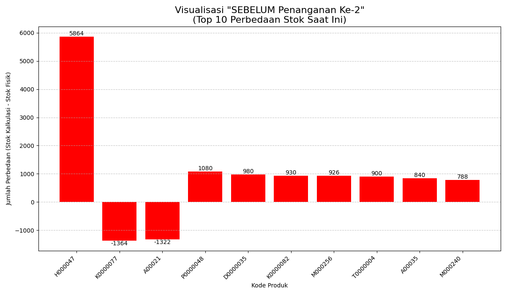
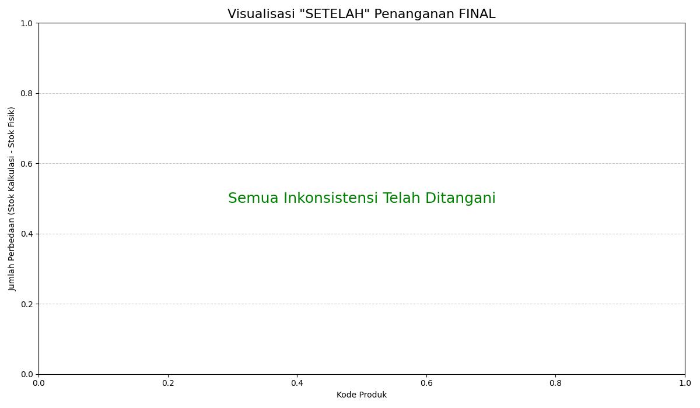

# 🚀 Proyek Analisis Kualitas Data & Rekonsiliasi Stok

Sebuah proyek untuk mendeteksi dan menangani inkonsistensi data stok secara massal menggunakan metode **Rule-Based (Constraint-Based Detection)**.

## 📊 Hasil Akhir: Dari Inkonsistensi Menjadi Konsisten

Visualisasi ini menunjukkan jumlah perbedaan stok (`Stok Kalkulasi - Stok Fisik`) untuk 10 item terparah **sebelum** dan **setelah** penanganan.

| SEBELUM Penanganan | SETELAH Penanganan |
| :---: | :---: |
|  |  |

---

## Masalah (The Problem)

Sistem inventaris mengalami masalah integritas data yang kritis. Terdapat ketidakcocokan (inkonsistensi) yang signifikan antara:
1.  **Stok Fisik (`stok_fix.csv`):** Jumlah stok yang seharusnya ada di rak.
2.  **Stok Kalkulasi:** Jumlah stok yang dihitung dari riwayat transaksi (`total pembelian - total penjualan`).

Analisis awal menemukan **1.614 item** yang datanya tidak sinkron, termasuk kasus parah di mana `STOK_KALKULASI` bernilai negatif (menjual barang yang tidak pernah tercatat pembeliannya).

## 🛠️ Metodologi dan Solusi

[cite_start]Mengacu pada pendekatan akademis tentang *Semantic Integrity Constraints*[cite: 1, 3], proyek ini tidak hanya mendeteksi tetapi juga menangani *outlier* menggunakan metode **Rule-Based** yang ketat.

### 1. 🧹 Pembersihan Data
* Memuat 3 dataset: `data_pembelian_final.csv`, `data_penjualan_final.csv`, dan `stok_fix.csv`.
* Membersihkan data: Menangani nilai *null*, mengonversi tipe data (string ke numerik), dan menghapus *whitespace*.

### 2. 🔍 Deteksi Inkonsistensi (Rule-Based Detection)
* **Definisi Aturan:** Sebuah aturan integritas semantik utama didefinisikan:
    > `QTY_STOK (Fisik) == SUM(QTY_MSK) - SUM(QTY_KLR)`
* **Deteksi Outlier:** Skrip memvalidasi setiap item terhadap aturan ini dan menghasilkan daftar **1.614 outlier** yang melanggarnya.

### 3. ✅ Penanganan (Rekonsiliasi Stok Massal)
Sesuai paper, *outlier* ini ditangani dengan "menandai" mereka menggunakan koreksi. Sebuah skrip rekonsiliasi massal (bulk reconciliation) dijalankan dengan logika:
* **Jika `PERBEDAAN` > 0 (Stok Kalkulasi > Stok Fisik):**
    * **Masalah:** Sistem mengira ada barang lebih (misal, 10 item) yang ternyata tidak ada (hilang/rusak).
    * **Solusi:** Buat "Jurnal Penyesuaian Keluar" (`ADJUST_KELUAR`) untuk 10 item tersebut.
* **Jika `PERBEDAAN` < 0 (Stok Kalkulasi < Stok Fisik):**
    * **Masalah:** Sistem kekurangan barang (misal, -20 item) karena transaksi pembelian tidak tercatat.
    * **Solusi:** Buat "Jurnal Penyesuaian Masuk" (`ADJUST_MASUK`) untuk 20 item tersebut.

Hasilnya, **1.614 transaksi penyesuaian** dibuat, dan jumlah inkonsistensi menjadi **0**.

---

## ⚙️ Cara Menjalankan

1.  **Clone repositori ini (jika ada):**
    ```bash
    git clone https://github.com/Alfariz11/UTS-Penambangan-Data.git
    cd UTS-Penambangan-Data
    ```
2.  **Pasang *requirements*:**
    Pastikan Anda memiliki pustaka yang diperlukan. Buat file `requirements.txt` dan jalankan:
    ```bash
    pip install -r requirements.txt
    ```
3.  **Tempatkan Data:**
    Pastikan 3 file data CSV Anda berada di direktori yang sama dengan Notebook:
    * `data_pembelian_final.csv`
    * `data_penjualan_final.csv`
    * `stok_fix.csv`
4.  **Jalankan Notebook:**
    Buka dan jalankan file `.ipynb`

## 📦 Kebutuhan Pustaka (`requirements.txt`)
